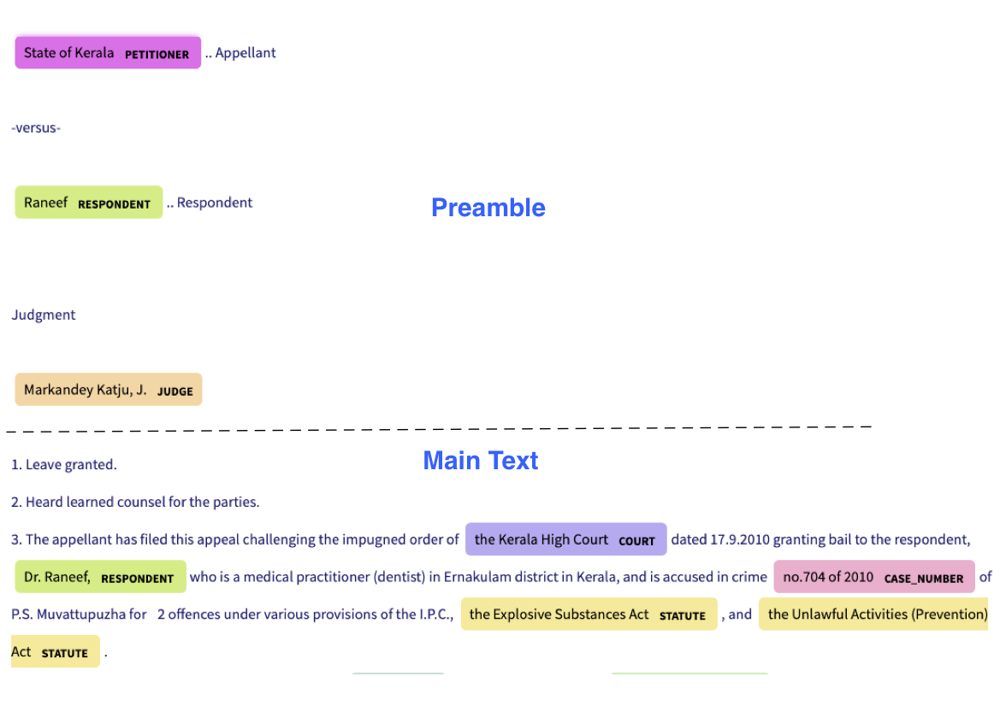

# legal_NER
#### This repo is associated with the paper "Named Entity Recognition in Indian court judgments" accepted at NLLP 2022 workshop at EMNLP.
#### For easy usage of all available OpenNyai models refer to our [OpenNyai Libray](https://github.com/OpenNyAI/Opennyai)

#### Try our models on hugging face [en_legal_ner_trf](https://huggingface.co/opennyaiorg/en_legal_ner_trf) and [en_legal_ner_sm](https://huggingface.co/opennyaiorg/en_legal_ner_sm)

## 1. Why Seperate NER for Indian Court Judgments?

Named Entities Recognition is commonly studied problem in Natural Language Processing and many pre-trained models are
publicly available. However legal documents have peculiar named entities like names of petitioner, respondent, court,
statute, provision, precedents, etc. These entity types are not recognized by standard Named Entity Recognizer like
spacy. Hence there is a need to develop a Legal NER model. But ther are no publicly available annotated datasets for
this task for Indian courts. Due to peculiarity of Indian legal processes and terminoligies used, it is important to
develop seperate legal NER for Indian court judgment texts.

## 2. Which Legal Entities are covered?

Some entities are extracted from Preamble of the judgements and some from judgement text. Preamble of judgment contains
formatted metadata like names of parties, judges, lawyers,date, court etc. The text following preamble till the end of
the judgment is called as the "judgment".
Below is an example 

This code can extract following named entities from Indian Court judgments.
<center>

| Named Entity             |    Extract From    | Description                                                                                                                                               |
|:---------------:|:------------------:|-----------------------------------------------------------------------------------------------------------------------------------------------------------|
| COURT          | Preamble, Judgment | Name of the court which has delivered the current judgement if extracted from Preamble. Name of any court mentioned if extracted from judgment sentences. |
| PETITIONER  | Preamble, Judgment | Name of the petitioners / appellants /revisionist  from current case                                                                                      |
| RESPONDENT | Preamble, Judgment | Name of the respondents / defendents /opposition from current case                                                                                        |
| JUDGE |      Premable, Judgment      | Name of the judges from current case  if extracted from preamble. Name of the judges of the current as well as previous cases if extracted from judgment sentences.       |                                                                                        |
| LAWYER |      Preamble      | Name of the lawyers from both the parties                                                                                                                 |
| DATE |      Judgment      | Any date mentioned in the judgment                                                                                                                        |
| ORG |      Judgment      | Name of organizations mentioned in text apart from court. E.g. Banks, PSU, private companies, police stations, state govt etc.                            |
| GPE |      Judgment      | Geopolitical locations which include names of countries,states,cities, districts and villages                                                             | 
| STATUTE |      Judgment      | Name of the act or law mentioned in the judgement                                                                                                         |
| PROVISION |      Judgment      | Sections, sub-sections, articles, orders, rules under a statute                                                                                           |
| PRECEDENT |      Judgment      | All the past court cases referred in the judgement as precedent. Precedent consists of party names + citation(optional) or case number (optional)         |
| CASE\_NUMBER |      Judgment      | All the other case numbers mentioned in the judgment (apart from precedent) where party names and citation is not provided                                |
| WITNESS    |      Judgment      | Name of witnesses in current judgment                                                                                                                     |
| OTHER_PERSON    |      Judgment      | Name of the all the person that are not included in petitioner,respondent,judge and witness                                                               |     

</center>

More detailed definitions with examples can be
found [here](https://docs.google.com/presentation/d/e/2PACX-1vSpWE_Qk9X_wBh7xJWPyYcWcME3ZBh_HmqeZOx58oMLyJSi0Tn0-JMWKI-HsQIRuUTbQHPql6MlU7OS/pub?start=false&loop=false&delayms=3000)

## 3. Data

Training data is available [here](https://storage.googleapis.com/indianlegalbert/OPEN_SOURCED_FILES/NER/NER_TRAIN.zip).
Dev data is available [here](https://storage.googleapis.com/indianlegalbert/OPEN_SOURCED_FILES/NER/NER_DEV.zip).

### 3.1 Raw Text used for Annotation

Judgements obtained
via [representative sample genration method](https://github.com/Legal-NLP-EkStep/legal_NER/tree/main/representative_judgments_sample)
during the time period from 1950 to 2017 were used to take sentences for annotation of training data. Judgements from
2017 to 2021 were used to select test data judgments. For preannotations, we used spacy pretrained model(
en_core_web_trf) with custom rules to predict the legal named entities. This model was used to select sentences which
are likely to contain the legal named entities. We also tried to reduce class imbalance across the entities by
upsampling the rare entities. The preannotated sentences were annotated by the legal experts and data scientists at
OpenNyAI.

Since the entities present in the preamble and judgment are different, 2 seperate files are provided for training data.
There are 9435 judgement sentences and 1560 preambles.
Entity Counts in Judgment train data

### 3.3 Nature of Entities

Document level context was not used during annotation. Complete preambles were presented for the annotations. Individual
sentences from judgment were provided for the NER annotations. The idea was to look at an independent sentence and
extract entities that could be inferred from that sentence.
Flat entities were considered for annotation i.e. "Bank of China" wer considered as ORG entity and "China" were not be
marked as GPE inside this entity.

### 3.2 Entity Stats

| Entity                                          | Judgment Count | Preamble Count |
|-------------------------------------------------------|----------------|----------------|
| COURT                                                 | 1293           | 1074           |
| PETITIONER                                            | 464            | 2604           |
| RESPONDENT                                            | 324            | 3538           |
| JUDGE                                                 | 567            | 1758           |
| LAWYER                                                |                | 3505           |
| DATE                                                  | 1885           |                |
| ORG                                                   | 1441           |                |
| GPE                                                   | 1398           |                |
| STATUTE                                               | 1804           |                |
| PROVISION                                             | 2384           |                |
| PRECEDENT                                             | 1351           |                |
| CASE\_NUMBER                                          | 1040           |                |
| WITNESS                                               | 881            |                |
| OTHER\_PERSON                                         | 2653           |                |
| Total                                          | 17485          | 12479          |

## 4. Training the NER baseline model

For training we have converted the data given in json format to spacy format and then trained our model using Spacy library

```bash
python -m spacy train training/config.cfg --output ./output --paths.train training/Combined_Data_Judgement_Preamble_spacy_format/train.spacy --paths.dev training/Combined_Data_Judgement_Preamble_spacy_format/dev.spacy
```

## 5. Using Legal NER model

We have trained an AI model which uses transition based dependency parser on top of the roberta-base model.
Baseline model was trained using [spacy-transformers](https://spacy.io/usage/training). The trained model was tested on
test data and following are the results.

The trained model can be used as follows

1. Create new virtual environment

```shell
python3 -m venv /path/to/new/virtual/environment
source /path/to/new/virtual/environment/bin/activate
```

2. Install the trained model

```shell
pip install https://huggingface.co/opennyaiorg/en_legal_ner_trf/resolve/main/en_legal_ner_trf-any-py3-none-any.whl
 ```

3. Install spacy pretrained model which is needed for splitting preamble and judgment

```shell
pip install https://github.com/explosion/spacy-models/releases/download/en_core_web_sm-3.2.0/en_core_web_sm-3.2.0-py3-none-any.whl
 ```

4. clone the git repo

```shell
git clone https://github.com/Legal-NLP-EkStep/legal_NER.git
cd legal_NER
```

5. Use following python script to use pretrained model to find all the entities in a custom input judgement.

```python 
import spacy
from data_preparation import get_text_from_indiankanoon_url
from spacy import displacy
from legal_ner import extract_entities_from_judgment_text
import urllib

legal_nlp=spacy.load('en_legal_ner_trf')
judgment_text = urllib.request.urlopen('https://raw.githubusercontent.com/OpenNyAI/Opennyai/master/samples/sample_judgment1.txt').read().decode()

preamble_spiltting_nlp = spacy.load('en_core_web_sm')
run_type='sent' ###  trade off between accuracy and runtime
do_postprocess=True 
combined_doc = extract_entities_from_judgment_text(judgment_text,legal_nlp,preamble_spiltting_nlp,run_type,do_postprocess)

```

Entities can be extracted in two ways which is controlled by parameter run_type:

a.Passing the whole judgment : Whole judgment is passed through the model and entities are extracted.
It take less time to run but can miss entities as compared to 'sent' method. Use run_type='doc' for this method.

b.Passing sentence by sentence:Each sentence is individually passed through model and entities are extracted.
It takes more time to run but more accurate than passing the whole judgment. Use run_type='sent' for this method.

## 6. Post Processing of extracted Named Entities

Since the document level context was not used duiring annotation,it is important to capture the document level context while inference. This can be done via postprocessing using rules.

To perform postprocessing on the extracted entities specify `do_postprocessing=True`.

The postprocessing is done on these entities:

1. `Precedents`: Same precedent can be written in multiple forms in a judgment. E.g. with citation,without
citation,only petitioner's name supra etc.For eg. 'darambir vs state of maharashtra 2016 AIR 54','darambir vs state of maharashtra 'and'darambir's case(supra)' all refer to the same case.All the precedents referring to the same case
are  clustered together and the longest precedent in the cluster is the head of the cluster.The output is a dict where the keys are the head of the cluster (longest precedent) and value
is a list of all the precedents in that cluster. To access the list, use

    `combined_doc.user_data['precedent_clusters']`

     For example
      [{Madhu Limaye v. State of Mahrashtra: [Madhu Limaye v. State of Mahrashtra, Madhu Limaye v. State of Maharashtra, Madhu Limaye, Madhu Limaye, Madhu  Limaye]}]

2. `Statute`: In a judgment,sometimes aconyms are used instead of the complete statute name.For eg.section 147 of  IPC,section 148 of Penal code is mentioned instead of Indian Penal code.We have incorporated the acronyms for some well known statutes such as IPC,CrPC,Income Tax act,Motor vehicles act,sarfaesi etc.All the statutes which are a short form of any of these well known statute belongs to the same cluster.For eg I.P.C,IPC,Penal code will belong to the same cluster with head as "Indian Penal code".
Many a times,the way a statute is referred within a judgment is explicitly mentioned .For eg. Motor Vehicle Act(herein referred as MV act).
So,every mention of MV act would belong to the same cluster with head as "Motor Vehicle Act". .It can be
used by:

    `combined_doc.user_data['statute_clusters']`

     For example:
     { 'Criminal Procedure Code': [Code of Criminal Procedure,Crpc] }


3. `Provision-Statute`: Every provision should have an associated statute.Sometimes the provision is followed by the statute it belongs to and   sometimes the
corresponding statutes are not mentioned explicitly .To find statutes for these implicit provisions,we search the judgment if the same provision is mentioned elsewhere along with the statute,if present we assign the same statute to the implicit provision.If not,the nearest statute prior to the provision is assigned to that provision after some validations.The statutes assogned are then normalised using the statute clusters
The output is a list of named tuples, each tuple contains provision-statute-normalised provision-normalised statutes text eg. (362,IPC,'Section 362','Indian Penal Code') .It can be
used by:

    `combined_doc.user_data['provision_statute_pairs']`

     For example
     [(Section 369, Crpc, 'Section 369','Criminal Procedure Code'), (Section 424, Crpc, 'Section 424','Criminal Procedure Code')]

4. `Other person/Org` : Same entities can be tagged with different classes in different sentences of
the same judgment due to sentence level context. E.g. 'Amit Kumar' can be  a petitioner
in the preamble but later in the judgment is marked as 'other_person'. So,we reconcile these entities
based on their relative importance i.e. 'Amit Kumar' will be marked as petitioner in the
whole judgment.


## 7.  Visualization of extracted Named Entities

To visualize the NER result on single judgment text please run


```
extracted_ent_labels = list(set([i.label_ for i in combined_doc.ents]))
colors = {'COURT': "#bbabf2", 'PETITIONER': "#f570ea", "RESPONDENT": "#cdee81", 'JUDGE': "#fdd8a5",
          "LAWYER": "#f9d380", 'WITNESS': "violet", "STATUTE": "#faea99", "PROVISION": "yellow",
          'CASE_NUMBER': "#fbb1cf", "PRECEDENT": "#fad6d6", 'DATE': "#b1ecf7", 'OTHER_PERSON': "#b0f6a2",
          'ORG':'#a57db5','GPE':'#7fdbd4'}
options = {"ents": extracted_ent_labels, "colors": colors}
displacy.serve(combined_doc, style='ent',port=8080,options=options)

```


Please click on the link displayed in the console to see the annotated entities.


## 8. Getting unique provisions,statutes and precedents 


1. To get a list of unique precedents within a judgment:

    ```
    precedents=get_unique_precedent_count(combined_doc)
    ```
    
It will return a dictionary with name of the precedents  as keys and number of times they occured as values.
 For eg. State of Punjab v. Phil  and Anr: [State of Punjab v. Phil Rani and Anr, Phil ]
    
    
2. To get frequency count of all the provisions within a judgment:


    ```
    provisions=get_unique_provision_count(combined_doc)
    ```
    
It will return a dictionary with name of the provisions as keys and number of times they occured as values.
 For eg.{'Article 226 of Constitution': 11, 'Article 227 of Constitution': 12}
 
3. To get frequency count of all the statutes within a judgment:


    ```
    statutes=get_unique_statute_count(combined_doc)
    ```


It will return a dictionary with name of the statutes as keys and number of times they occured as values.
 For eg.{'Constitution': 30, 'Criminal Procedure Code': 77, 'Indian Penal Code': 13}
    


## 9. Storing extracted Named Entities to a file

1. To save result in csv file with linked entities :


    ```
    get_csv(combined_doc,file_name,save_path)
    ```
In the created csv,it will have 4 columns namely:

'file_name': name of the file/judgment

'entity': The entity found in the judgment .For eg.'section 482' ,'constiution','sibbia vs ajay'

'label': The label associated with each entity .For eg. label of 'section 482' would be 'provision'

'normalised entities': Entities including provision,statute and precedents are normalised as follows:

   1.'Provision': Each provision is normalised by adding the statute associated with it alongside. For eg.'section 147' is normalised to 'Section 147 of Indian Penal Code'

   2.'Statute': Each statute is normalised by adding its full form if present .For eg.'IPC' is normalised to 'Indian Penal Code'

   3.'Precedent': Each precedent is normalised by checking if the particular precedent is mentioned elsewhere in the judgment and is longer than the current precent(has citations,full names etc.). For eg. normalised entity for 'amber v. State of Haryana' would be 'amber v. State of Haryana R.C.R. (Crl.)2007' 


## 10. Google Colab Examples

| Description               | Link  |
|---------------------------|-------|
| Run Inference          | [](https://colab.research.google.com/drive/15KEXbcCBXsqJksu7j2hwTyMp5cT9852y?usp=sharing) |

## 11. Evaluation

Evaluation portal will be made available soon.

## Acknowledgements

This work is part of [OpenNyAI](https://opennyai.org/) mission which is funded by [EkStep](https://ekstep.org/)
and [Agami](https://agami.in/). 
