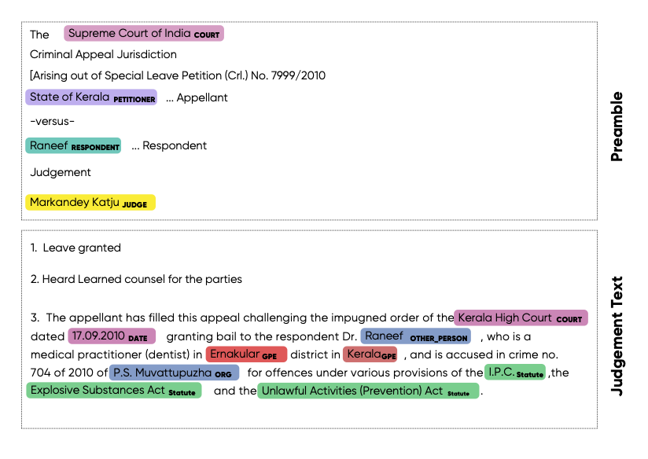

# legal_NER
## 1. Why Seperate NER for Indian Legal Texts?
Named Entities Recognition is commonly studied problem in Natural Language Processing and many pre-trained models are publicly available. However legal documents have peculiar named entities like names of petitioner, respondent, court, statute, provision, precedents,  etc. These entity types are not recognized by standard Named Entity Recognizer like spacy. Hence there is a need to develop a Legal NER model. But ther are no publicly available annotated datasets for this task. In order to help the data annotation process, we have created this rule based approach on top of pretrained spacy models. The NER tags created could be inspected by humans to correct which eventually could be used to train an AI model.
## 2. Which Legal Entities are covered?
This code can extract following named entities from Indian Court judgments. Some entities are extracted from Preamble of the judgements and some from judgement text. Preamble of judgment contains formatted metadata like names of parties, judges, lawyers,date, court etc. The text following preamble till the end of the judgment is called as the "judgment".
Below is an example 
| Named Entity             | Extract From    | Description |
| --------------- | -------- | ------------------------------------------------------------------------------------------------------------------------------------------------------------------------------------------------------------------------------------------ |
| Court           | Preamble      | Name of the court which has delivered the current judgement |
| Court           | Judgement      | Name of the judge of the current as well as previous cases |
| Petitioner  | Preamble, Judgment   | Name of the petitioners / appellants /revisionist  from current case |
| Respondent Name | Preamble, Judgment   | Name of the respondents / defendents /opposition from current case |
| Judge | Premable | Name of the judges from current case |
| Judge | Judgment | Name of the judges of the current as well as previous cases |
| Lawyer | Preamble | Name of the lawyers from both the parties |
| Date | Judgment  | Any date mentioned in the judgment |
| Organization | Judgment  | Name of organizations mentioned in text apart from court. E.g. Banks, PSU, private companies, police stations, state govt etc. |
| Geopolitical Entity | Judgment | Geopolitical locations which include names of countries,states,cities, districts and villages | 
| Statute | Judgment | Name of the act or law mentioned in the judgement |
| Provision | Judgment | Sections, sub-sections, articles, orders, rules under a statute |
| Precedent | Judgment | All the past court cases referred in the judgement as precedent. Precedent consists of party names + citation(optional) or case number (optional) |
| Case number | Judgment | All the other case numbers mentioned in the judgment (apart from precedent) where party names and citation is not provided |
| Witness Name    | Judgment   | Name of witnesses in current judgment |
| other person    | Judgment   | Name of the all the person that are not included in petitioner,respondent,judge and witness |       

## 3. Data
## 3.1 Representative sample of Indian Court Judgments 
A representative sample of Indian court judgment was created by taking most cited IndianKanoon judgments controlling for court and case type. Court were stratefied as per following table.
| Court Category | Percentage in  Representative Sample | Covered Courts|
| -------------- | -------------------- | --------------------------------|
| Supreme Court | 20 | Supreme court | Supreme Court | 
| High Courts | 70 | 5% from each of following 14 high courts. Bombay, Madras, Gujrat, Delhi, Punjab- Haryana, Karnataka, Rajasthan, Telengana, Allahabad, Kerala, Madhya Pradesh, Calcutta, Patna, Andhra | 
| District courts | 5 | Delhi district ,Banglore district |
| Tribunals | 5 | CEGAT , ITAT, STATE TAXATION, CESTAT, Copyright Board, IPAB, CLB, NCLAT, Debt Recovery, SAT |

Taking most cited judgments from a given court would result in bias in certain types of cases (E.g. criminal cases). Hence it is needed to control for types cases to consider the variety of judgements. So we created following 8 types of cases (tax, criminal ,civil, Motor Vehicles, Land & Property, Industrial & Labour, Constitution, Financial) which are most frequently present. Classification of each judgement into one these 8 types is complex task. We have used naive approach to use act names for assigning a judgment to a case type. E.g. if judgment mentions "tax act" then most probably it belongs to "tax" category. Following are the key act names were used in the Indian Kanoon search queries.  

| Case Type | Percentage in each court | Key Act keywords|
| -------------- | -------------------- | --------------------------------|
| Tax | 20 |  tax act , excise act, customs act, goods and services act etc. |
| Criminal | 20 | IPC, penal code, criminal procedure etc. |
| Civil | 10 | civil procedure, family courts, marriage act, wakf act etc. |
| Motor Vehicles | 10 | motor vehicles act, mv act, imv act etc. |
| Land \& Propery | 10 | land acqusition act, succession act, rent control act etc. |
| Industrial \& Labour | 10 | companies act, industrial disputes act, compensation act etc.|
| Constitution | 10 | constitution |
| Financial | 10 | negotiable instruments act, sarfaesi act, foreign exchange regulation act etc.|

 
## Installation
1. Clone the git repo
2. Create a new virtual environment & activate it

```
python3 -m venv /path/to/new/virtual/environment
```

```
source  /path/to/new/virtual/environment/bin/activate
```

4. Install the required packages
```
cd legal_NER
```

```
pip install -r requirements.txt
```

5. Download spacy models

```
python -m spacy download en_core_web_trf
```

```
python -m spacy download en_core_web_sm
```

## Extracting entities from input court judgment text
Please refer to legal_ner.py for extracting entities from custom text.
```python
    from legal_ner import create_spacy_pipelines,extract_entities_from_judgment_text
    from data_preparation import get_text_from_indiankanoon_url
    ############## Get judgment text from indiankanoon or paste your own text 
    indiankanoon_url = 'https://indiankanoon.org/doc/542273/'
    txt = get_text_from_indiankanoon_url(indiankanoon_url) ######## or txt ='paste your judgment text'

    ######## create spacy pipelines needed for preamble & main text
    nlp_preamble,nlp_judgment = create_spacy_pipelines()

    ########## Extract Entities
    combined_doc = extract_entities_from_judgment_text(txt,nlp_judgment,nlp_preamble)

    ########### show the entities
    extracted_ent_labels = list(set([i.label_ for i in combined_doc.ents]))
    colors = {'COURT':"#bbabf2",'PETITIONER': "#f570ea", "RESPONDENT": "#cdee81",'JUDGE':"#fdd8a5","LAWYER":"#f9d380",
              'WITNESS':"violet","STATUTE":"#faea99","PROVISION":"yellow",'CASE_NUMBER':"#fbb1cf","PRECEDENT":"#fad6d6",
              'POLICE_STATION':"#b1ecf7",'OTHER_ORG':"#b0f6a2"}
    options = {"ents": extracted_ent_labels, "colors": colors}

    displacy.serve(combined_doc, style='ent',port=8080,options=options)

```
The output will look like below


## Customizing rules for best results on your data
The rules are written based on the observations from typrical judgments. So it may miss some entities from text. The accuracy of the legal NER is dependent on the accuracy of the spacy pipelines. It is observed that many entities in preamble are missed because the names are not identified as proper nouns. This is because the preamble sentences are not proper English sentences. As next steps OpenNyAI would collect human annotated data for NER and we expect that these models would give much better performance. Till then you can customize the rules as per your data to make this better.

## Acknowledgements
This work is part of [OpenNyAI](https://opennyai.org/) mission which is funded by [EkStep](https://ekstep.org/) and [Agami](https://agami.in/). 
